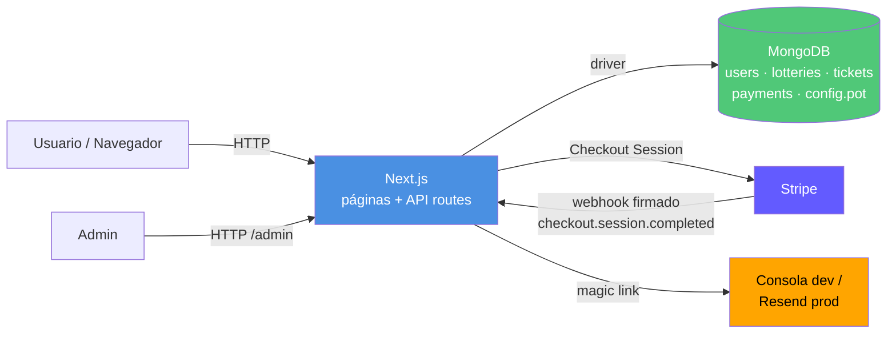
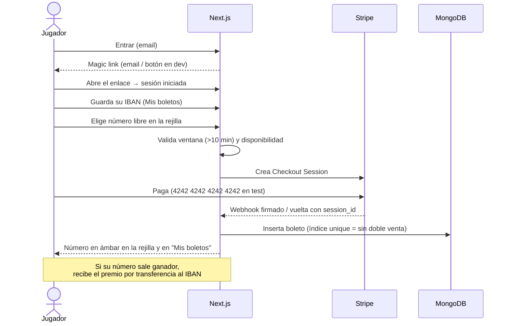
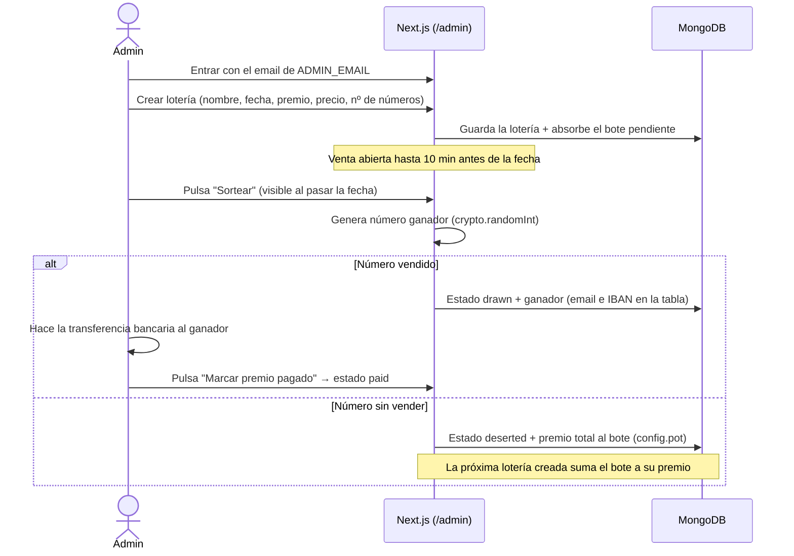

# Lottery 🎟️

Sistema de lotería online con premio único: el administrador crea sorteos, los
usuarios entran con **magic link**, compran un número pagando con **Stripe** y,
al llegar la fecha, se sortea un número ganador cuyo premio se paga por
**transferencia bancaria** al IBAN del perfil. Si el número ganador no se
vendió, el premio **se acumula como bote** para la siguiente lotería.

> Especificación completa: [PROMPT.md](PROMPT.md) · Guía operativa: [AGENTS.md](AGENTS.md) · Arranque en 5 min: [QUICKSTART.md](QUICKSTART.md)

## Stack

Next.js (App Router, full-stack) · Tailwind CSS v4 · MongoDB · Stripe Checkout ·
magic link (consola en dev / Resend en prod) · Vitest.

## Instalación y arranque

```bash
npm install
cp .env.example .env.local   # rellenar claves de Stripe
npm run seed                 # datos de ejemplo + índices (Mongo en 127.0.0.1:27017)
npm run dev                  # http://localhost:3000
```

En desarrollo el magic link de login aparece como botón en la propia página
(y también en la consola del servidor). Admin por defecto: `admin@lottery.dev`
(variable `ADMIN_EMAIL`).

## Arquitectura



Flujo de compra (RF-07): el usuario elige un número libre en la rejilla → la API
valida ventana de compra y disponibilidad → Stripe Checkout → el **webhook**
(firma verificada) inserta el boleto. El índice unique `{lotteryId, number}` es
la barrera final contra la doble venta: si salta, el pago se reembolsa.

Flujo del sorteo (RF-09/RF-04): pasada la fecha final, aparece el botón
**Sortear** en el panel de admin. El número ganador no se introduce a mano: se
genera con `crypto.randomInt` al pulsarlo. Número vendido → estado `drawn`, la
tabla muestra email e IBAN del ganador, el admin hace la transferencia y pulsa
"Marcar premio pagado" (→ `paid`). Número sin vender → estado `deserted` y el
premio total pasa al bote (`config.pot`), que absorbe automáticamente la
próxima lotería creada.

## Roles

| Rol | Cómo se obtiene | Qué ve/hace |
|---|---|---|
| Usuario | Login con cualquier email (magic link) | Compra números, guarda su IBAN, consulta "Mis boletos" |
| Admin | Login con el email de `ADMIN_EMAIL` | Menú **Admin**: crear loterías, sortear, marcar premio pagado. No compra boletos (sin "Mis boletos") |

Estados de una lotería: `open` (en venta) → `drawn` (sorteada, pago pendiente) →
`paid` (premio transferido), o `open` → `deserted` (número ganador sin vender,
premio al bote). Guía paso a paso: [QUICKSTART.md](QUICKSTART.md).

## Secuencias de operación

### Jugador



### Administrador



## Tests

```bash
npm test          # 19 tests unitarios: ventana de compra, IBAN mod-97, bote, validaciones
npm run test:e2e  # 5 e2e Playwright: portada, magic link, IBAN, rejilla, control de acceso
npm run test:cov  # cobertura
```

Política: cada RF tiene ≥1 test (ver PROMPT.md §4). Los e2e usan el dev server
(lo arrancan solos) y requieren MongoDB local con seed.

## Métricas

Objetivos en PROMPT.md §5. Medidas el 2026-07-05 contra el **build de
producción** (`npm run build && npm start`) en local, con
`npx autocannon -c 50 -d 10` y `npx tsx scripts/metrics.ts` (explain de
índices, test de concurrencia y tamaños). Reproducibles con esos dos comandos.

| Métrica | Objetivo | Medido | |
|---|---|---|---|
| Latencia `GET /api/lotteries` (50 conex.) | p95 < 300 ms | p50 85 ms · p97.5 177 ms · p99 220 ms | ✅ |
| Latencia `GET /api/lotteries/[id]` (50 conex.) | p95 < 300 ms | p50 64 ms · p97.5 85 ms | ✅ |
| Concurrencia (100 conexiones) | sin degradación crítica | p99 212 ms · 690 req/s · 0 errores | ✅ |
| Throughput | — | 542–749 req/s según endpoint | ✅ |
| Query tickets por lotería | < 50 ms, por índice | 3 ms · índice `lotteryId_1_number_1` · 0 docs de más examinados | ✅ |
| Query loterías abiertas ordenadas | < 50 ms, por índice | 0 ms · índice `status_1_endDate_1` | ✅ |
| Doble venta bajo concurrencia | 0 (100 compras simultáneas del mismo número) | 1 insertado / 99 rechazados por el índice unique (47 ms) | ✅ |
| Tamaño por boleto | < 1 KB | 154 B/doc (lotería 208 B, usuario 101 B) | ✅ |

## Deployment

Guía y restricciones del CI de la academia: [AGENTS.md](AGENTS.md) §Deployment y §CI.
Repos: [GitHub](https://github.com/OSCARJORGERAPP/lottery) ·
[GitLab](https://gitlab.codecrypto.academy/ojrapp/lottery) (siempre sincronizados).
